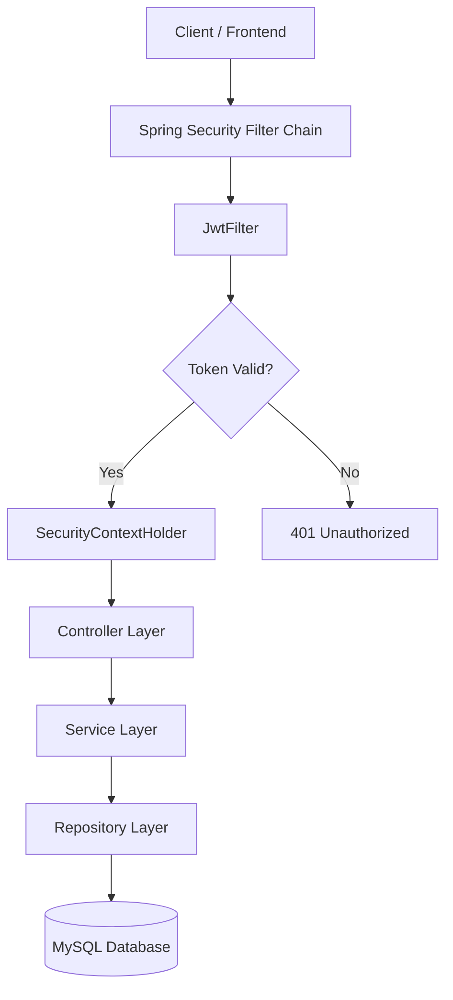
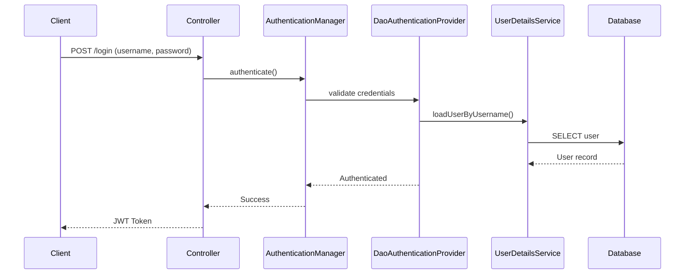
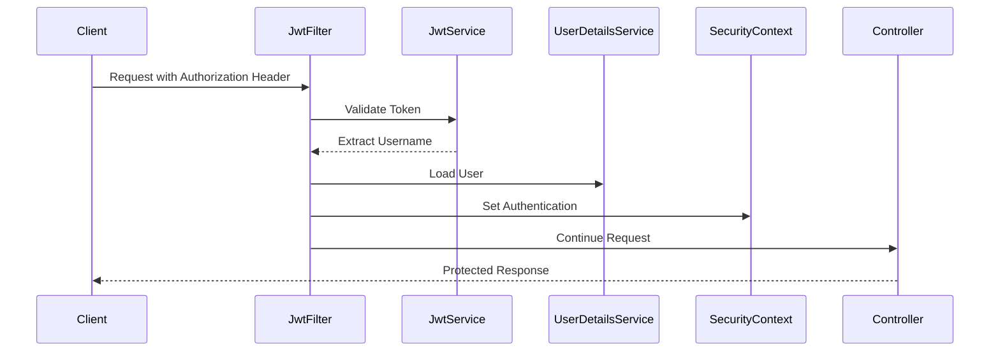
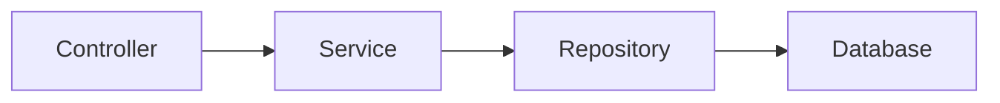

# 🔐 Enterprise-Grade JWT Authentication System  
### Spring Boot 3 • Spring Security 6 • Stateless Architecture • Production-Ready Design

---

## 📌 Overview

This project is a **production-style implementation of stateless authentication** using:

- **Spring Boot 3**
- **Spring Security 6**
- **JWT (JSON Web Tokens)**
- **JPA / Hibernate**
- **MySQL**

It demonstrates how to build a secure, scalable REST API using modern Spring Security best practices.

This repository reflects **enterprise-level architecture patterns**, security hardening decisions, and clean configuration practices.

---

# 🚀 Key Features

- Stateless Authentication (No server sessions)
- Custom JWT Authentication Filter
- Secure Password Hashing (BCrypt)
- DAO-based Authentication Provider
- Clean Security Filter Chain Configuration
- Layered Architecture (Controller → Service → Repository)
- MySQL Integration via JPA
- Production-Ready Structure

---

# 🏗 System Architecture



---

# 🔄 Authentication Flow (Login)



---

# 🔄 Authorization Flow (Protected Endpoint)



---

# 🧠 Security Design Decisions

| Decision | Reason |
|----------|--------|
| Stateless Authentication | Scalable & Cloud-friendly |
| JWT | Decoupled authentication mechanism |
| OncePerRequestFilter | Ensures validation per request |
| DaoAuthenticationProvider | Standard credential validation |
| BCryptPasswordEncoder | Secure password hashing |
| SessionCreationPolicy.STATELESS | Prevents server session usage |
| Custom SecurityFilterChain | Explicit and predictable configuration |

---

# 🏛 Layered Architecture



### Responsibilities

- **Controller** → Handles HTTP layer
- **Service** → Business logic & JWT handling
- **Repository** → Database interaction
- **Filter** → Request interception & authentication

---

# 📂 Project Structure

```
src/main/java/com/yourpackage/

├── config/
│   └── SecurityConfig.java
│
├── controller/
│   └── AuthController.java
│
├── entity/
│   └── User.java
│
├── repository/
│   └── UserRepository.java
│
├── service/
│   ├── JwtService.java
│   └── CustomUserDetailsService.java
│
├── filter/
│   └── JwtFilter.java
│
└── SpringSecurityApplication.java
```

---

# 🔐 Security Configuration Overview

### Stateless Configuration

```java
.sessionManagement(session ->
    session.sessionCreationPolicy(SessionCreationPolicy.STATELESS))
```

### JWT Filter Registration

```java
.addFilterBefore(jwtFilter, UsernamePasswordAuthenticationFilter.class)
```

### Public Endpoints

```java
.requestMatchers("/login", "/register").permitAll()
```

---

# 🗄 Database Schema

### User Table

| Field | Type |
|-------|------|
| id | Long |
| username | String |
| password | String (BCrypt) |
| role | String |

---

# 🧪 API Usage

## Register

```
POST /register
```

```json
{
  "username": "user1",
  "password": "1234"
}
```

---

## Login

```
POST /login
```

Response:

```json
{
  "token": "eyJhbGciOiJIUzI1NiIsInR5cCI6IkpXVCJ9..."
}
```

---

## Access Protected Endpoint

```
GET /api/secure
Authorization: Bearer <token>
```

---

# ⚙ Production Considerations

- HTTPS enforcement recommended
- Token expiration policy enforced
- Password hashing with BCrypt
- No sensitive data stored inside JWT
- Ready for containerization
- Easily extendable for:
  - Role-based authorization
  - Refresh tokens
  - Token revocation/blacklisting
  - OAuth2 integration

---

# 🏢 Job Application / Resume Context

This project demonstrates:

- Deep understanding of Spring Security internals
- Manual SecurityFilterChain configuration
- Custom AuthenticationProvider usage
- JWT-based stateless architecture
- Real-world authentication flow implementation
- Clean separation of concerns
- Modern Spring Boot 3 conventions

It showcases practical backend engineering skills relevant for:

- Backend Developer
- Java Developer
- Spring Boot Developer
- API Engineer

---

# 🎯 Learning Outcomes

- Authentication vs Authorization internals
- Spring Security Filter Chain lifecycle
- SecurityContextHolder mechanics
- JWT signing & validation
- DAO authentication flow
- Stateless API architecture

---

# 📈 Future Improvements

- Role-based Access Control (RBAC)
- Method-level security (`@PreAuthorize`)
- Refresh Token mechanism
- Docker & Kubernetes deployment
- CI/CD pipeline
- Integration testing with Testcontainers

---

# 🧾 License

Educational & demonstration purposes.
